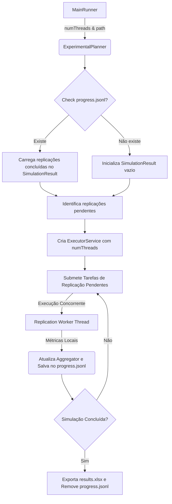

# SNetS2: Multithreading e Recuperação de Progresso (Checkpointing)

Este documento detalha o design técnico, a arquitetura concorrente e a estratégia de recuperação de falhas implementados no orquestrador de experimentos do SNetS2.

---

## 1. Visão Geral do Arquitetura

O simulador de eventos discretos do SNetS2 executa múltiplos cenários e replicações para obter relevância científica. A orquestração desses experimentos é de responsabilidade da classe [ExperimentalPlanner](file:///Users/iallen/Dev/java/SNetS2/src/main/java/com/snets2/ExperimentalPlanner.java).

Para maximizar a eficiência e a robustez em simulações de longa duração, foram implementadas duas grandes melhorias arquiteturais:
1. **Processamento Multithreading:** Cada replicação individual (que é independente estocasticamente) é executada concorrentemente em uma thread pool.
2. **Recuperação de Progresso (Checkpointing):** Salvamento incremental do progresso de cada replicação finalizada em um arquivo de log estruturado. Em caso de interrupção abrupta (ex: queda de energia, encerramento de processo), a simulação pode retomar de onde parou.



---

## 2. Processamento Multithreading

O paralelismo ocorre a nível de **replicação estocástica**, uma vez que diferentes replicações do mesmo cenário utilizam sementes distintas e são completamente desacopladas logicamente.

### ExecutorService e Pool de Threads
Em [ExperimentalPlanner.java](file:///Users/iallen/Dev/java/SNetS2/src/main/java/com/snets2/ExperimentalPlanner.java), a execução concorrente é controlada por um `ExecutorService` de tamanho fixo:

```java
ExecutorService executor = Executors.newFixedThreadPool(numThreads);
```

As variáveis do sweep de parâmetros são ordenadas alfabeticamente para garantir a geração estável e determinística das combinações de cenários (produto cartesiano). Cada replicação pendente é enfileirada e processada conforme a disponibilidade das threads na pool.

### Thread-safety no Coletor de Métricas
Como múltiplas threads gravam resultados simultaneamente, o agregador central [SimulationResult](file:///Users/iallen/Dev/java/SNetS2/src/main/java/com/snets2/output/SimulationResult.java) foi projetado para ser thread-safe através da sincronização do método `addValue`:

```java
public synchronized void addValue(String sheet, String subMetric, Map<String, String> dimensions, 
                     Map<String, Object> scenario, int repId, double value) {
    // Escrita segura nas coleções internas
}
```

Para isolar o cálculo das métricas de cada replicação individual e evitar interferência entre threads durante a execução, cada tarefa concorrente utiliza uma instância local de `SimulationResult` (`repResult`). Somente no término da replicação os valores computados são transferidos e agregados atomicamente ao `SimulationResult` compartilhado.

### Acompanhamento do Progresso em Tempo Real
O progresso total do lote de experimentos é calculado de forma thread-safe utilizando um contador atômico (`AtomicInteger`) de tarefas concluídas em relação ao produto total de cenários e replicações:

```java
int current = completedCounter.incrementAndGet();
double percent = (double) current * 100.0 / totalTasks;
System.out.println(String.format("Progress: %.2f%% (%d/%d replications)", percent, current, totalTasks));
```

Se a execução for retomada de um checkpoint, o progresso acumulado inicial é imediatamente calculado e exibido com base no volume de replicações lidas no arquivo `progress.jsonl`.

---

## 3. Lógica de Checkpointing (Recuperação de Progresso)

A persistência do progresso é realizada de forma incremental por meio de um arquivo no formato **JSON Lines (JSONL)** denominado `progress.jsonl` criado dentro da pasta do experimento.

### Formato do Checkpoint
Cada linha do arquivo `progress.jsonl` representa uma replicação de simulação concluída com sucesso e contém a representação JSON completa da classe estática interna `ProgressRecord`:

```json
{
  "scenario": {
    "traffic.load": 1500.0,
    "simulation.spectrumAssignment": "firstfit"
  },
  "repId": 0,
  "metrics": [
    {
      "sheet": "BlockingProbability",
      "subMetric": "General",
      "dimensions": {},
      "value": 0.0384
    },
    {
      "sheet": "SpectrumUtilization",
      "subMetric": "Mean",
      "dimensions": {
        "core": "0"
      },
      "value": 0.421
    }
  ]
}
```

### Mecanismo de Salvamento e Gravação Síncrona
Ao concluir uma replicação, os dados estruturados no formato acima são convertidos para JSON e anexados ao arquivo de checkpoint de forma thread-safe utilizando um bloco de sincronização no descritor de arquivo:

```java
synchronized (progressFile) {
    try (BufferedWriter writer = new BufferedWriter(new FileWriter(progressFile, true))) {
        writer.write(jsonLine);
        writer.newLine();
    }
}
```

### Mecanismo de Resumo (Resume)
Ao iniciar uma execução, o [ExperimentalPlanner](file:///Users/iallen/Dev/java/SNetS2/src/main/java/com/snets2/ExperimentalPlanner.java) verifica se o arquivo `progress.jsonl` existe:
1. O arquivo é lido linha por linha.
2. Cada registro é deserializado pelo Jackson.
3. Os valores das métricas registradas na replicação anterior são reinseridos no `SimulationResult` compartilhado.
4. Um identificador único baseado no JSON canônico do cenário (com chaves ordenadas) e o ID da replicação (`canonicalScenario + ":::" + repId`) é inserido em um conjunto de controle concorrente (`completedReplications`).
5. No loop de agendamento de tarefas concorrentes, qualquer replicação que corresponda a uma chave presente no conjunto de controle é simplesmente ignorada (pula para a próxima).

### Descarte no Término
Assim que todas as replicações do sweep são concluídas sem erros e o arquivo Excel final (`results.xlsx`) é gravado com sucesso, o arquivo `progress.jsonl` é excluído para que futuras execuções do mesmo lote comecem limpas.

---

## 4. Parâmetros de CLI e Execução

O simulador requer a especificação da quantidade de threads a serem alocadas e o caminho do diretório contendo o arquivo `setup.json`.

### Chamada da CLI
```bash
java -cp <classpath> com.snets2.MainRunner <caminho_pasta_experimento> <quantidade_threads>
```

Exemplo prático de execução com 4 threads concorrentes:
```bash
java -cp "target/classes:dependency/*" com.snets2.MainRunner experiments/experiment01 4
```
