# SNetS2: Relatório de Verificação e Validação

> **Escopo.** Evidência experimental de que o SNetS2 faz o que o seu modelo formal prevê (*verificação*) e de que o modelo se comporta como a teoria e a literatura esperam (*validação*). Os experimentos vão do mais simples, com solução analítica exata, até redes SDM com camada física.
> **Base.** `main` após os PRs [#24](https://github.com/iallengabio/SNetS2/pull/24)–[#29](https://github.com/iallengabio/SNetS2/pull/29), que corrigiram os achados da primeira campanha (29/09/2026). Os resultados da primeira campanha, feita após o PR [#11](https://github.com/iallengabio/SNetS2/pull/11), estão resumidos em §13.
> **Companheiros.** [Plano de verificação](03_plano_de_verificacao.md) (IDs `Lx-y`) e [code review](02_code_review.md) (IDs `CR-xx`).
> **Reprodução.** `scripts/verification/run_campaign.sh` (≈ 25 min em 10 núcleos). Dados brutos em [`vv/data`](vv/data), figuras em [`vv/figures`](vv/figures) e todas as tabelas geradas em [`vv/tables.md`](vv/tables.md).

## 0. Resumo executivo

| # | Experimento | Plano | Oráculo | Pontos | Resultado |
| :-: | :-- | :-: | :-- | :-: | :-- |
| E1 | Enlace único M/M/c/c | L2-a/b | Erlang B e utilização A(1−B)/c | 24 × 2 | ✅ todos dentro do critério (máx. \|z\| = 2,9) |
| E2 | Transmissores como servidores | L3-a | Erlang B por nó | 10 | ✅ (máx. \|z\| = 3,2); 100 % das causas = falta de Tx |
| E3 | Duas classes em um enlace | L4-a/b | Kaufman–Roberts | 6 × 4 | ✅ KR é limite inferior da classe larga e do bloqueio de banda; First-Fit ≡ Last-Fit bit a bit |
| E4 | Linha de 3 nós com continuidade de espectro | L6-a | Cadeia de Markov exata (625 estados, First-Fit) | 18 | ✅ (máx. \|z\| = 2,95) |
| E5 | Algoritmos RMSA na NSFNET | L8-b, L12-b | Ordenação da literatura | 8 variantes × 6 cargas | ✅ RF ≫ FF ≈ EF; KSP < SP; adaptativa < fixa |
| E6 | Consumo de energia | L11-a/b | Fórmula do circuito e lei de Little | 15 + 15 | ✅ com e sem *warm-up* (erro ≤ 0,2 %) |
| E7 | Modelos da camada física | L9-a/b/c/e/h | ASE, GN e XT em forma fechada | 6 verificações | ✅ erro ≤ 10⁻¹⁴; `maxRange` derivado do próprio modelo |
| E8 | Rede SDM com camada física | L9-k, L10 | Monotonicidade e tendências da literatura | 11 variantes × 5 cargas | ✅ monotonicidade; nova atribuição de núcleo ≤ Random-Fit em todas as cargas; ⚠️ `qot-adaptive` bloqueia mais em carga alta |

**Conclusões principais**

1. **O núcleo de simulação a eventos discretos está verificado.** Bloqueio, utilização, bloqueio por transmissores e bloqueio com continuidade de espectro em dois saltos coincidem com os oráculos exatos em todos os 52 pontos testados, sem viés detectável.
2. **Os algoritmos de alocação reproduzem as tendências clássicas da literatura**, e as simetrias esperadas aparecem de forma exata (First-Fit e Last-Fit dão resultados idênticos em todos os dígitos).
3. **O modelo de energia está verificado.** Após as correções de [#24](https://github.com/iallengabio/SNetS2/pull/24), a potência média satisfaz a lei de Little com e sem *warm-up*, a potência estática não depende mais do número de transceptores instalados e energia e ASE usam a mesma cadeia de amplificadores.
4. **A camada física implementa as fórmulas com precisão de máquina**, e a potência ótima coincide com a previsão analítica do modelo GN. O `maxRange` agora é derivado do próprio modelo (carga plena, pior taxa de bits), por isso é conservador: na rede SDM testada, ASE e NLI continuam sem bloquear com a política por alcance. O primeiro bloqueio por QoT aparece com a política `qot-adaptive`, nos circuitos já estabelecidos.
5. **Em redes multinúcleo, a atribuição de núcleo domina o bloqueio.** A nova estratégia `xtawarecore` com a política de espectro `corestaggeredfit` bloqueia no máximo tanto quanto o Random-Fit de núcleo em todas as cargas, e reduz o bloqueio por XT nos circuitos ativos em cerca de 10 vezes.
6. **Escolher sempre o formato mais eficiente não é a melhor política quando o crosstalk domina.** A `qot-adaptive` usa 9–16 % menos slots por circuito, mas bloqueia 10–16 % mais acima de 800 Erl.

---

## 1. Metodologia

* **Caminho de execução.** Toda simulação passa por `ExperimentalPlanner.runReplication`, o mesmo método usado em produção (extraído neste trabalho). A campanha está em `src/test/java/com/snets2/verification/VerificationCampaign.java`. Cada cenário é descrito em JSON, lido por `ConfigLoader` e validado por `ConfigValidator`.
* **Replicações e sementes.** São 10 replicações independentes (5 nos cenários de rede), com sementes 0…n−1. Variantes de um mesmo experimento usam as mesmas sementes (números aleatórios comuns).
* **Estatística.** Média, erro-padrão (EP) e intervalo de confiança de 95 % pela t de Student. O critério de aprovação é o do plano: $|\bar x - \theta| \le 4\,EP + 10^{-3}$. Também se reporta o escore $z = (\bar x - \theta)/EP$.
* **Transiente.** Os cenários começam com a rede vazia. As primeiras requisições são descartadas (*warm-up*: 10 k a 20 k) e o resultado vem das requisições seguintes (100 k a 280 k por réplica).
* **Regressão.** Versões rápidas de E1–E4, E6b e E7 rodam no `mvn test` (§12).
* **Oráculos** implementados de forma independente em `scripts/verification/analyze.py`: Erlang B, Kaufman–Roberts, cadeia de Markov de tempo contínuo resolvida numericamente, ASE da cadeia de amplificadores, GN em forma fechada e XT de acoplamento de potência.

---

## 2. E1 — Enlace único M/M/c/c (Erlang B)

**Cenário.** Dois nós e dois enlaces opostos, 1 núcleo, $c$ slots, QoT desligado. Toda requisição ocupa 1 slot (25 Gbps em 4QAM, sem FEC nem banda de guarda). Cada sentido recebe metade da carga, $A$. Foram testados $c \in \{1, 5, 20, 80\}$, com cargas escolhidas para dar $B \in \{10^{-3}, 10^{-2}, 0{,}05, 0{,}1, 0{,}2, 0{,}4\}$.

**Oráculo.** Fórmula de Erlang B, $B(A,c) = \frac{A^c/c!}{\sum_{k=0}^{c} A^k/k!}$, calculada pela recursão estável $B_k = A B_{k-1}/(k + A B_{k-1})$. A utilização média do espectro é $U = A(1-B)/c$ (lei de Little).

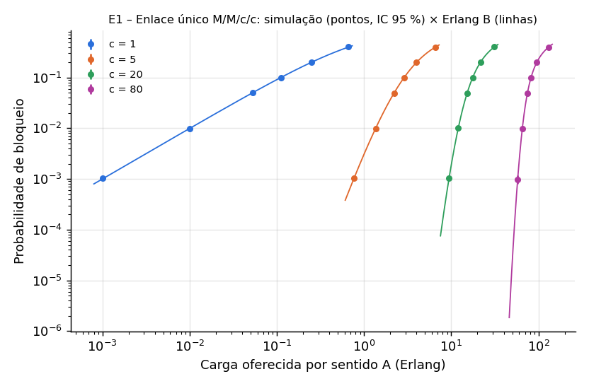

| c | B alvo | B simulado (IC 95 %) | erro rel. | U teórica | U simulada |
| :-: | :-: | :-: | :-: | :-: | :-: |
| 1 | 0,01 | 0,00993 ± 0,00015 | −0,7 % | 0,00999 | 0,00999 |
| 5 | 0,1 | 0,0995 ± 0,0008 | −0,5 % | 0,519 | 0,519 |
| 20 | 10⁻³ | 0,00103 ± 0,00010 | +2,8 % | 0,470 | 0,470 |
| 20 | 0,2 | 0,1994 ± 0,0009 | −0,3 % | 0,865 | 0,865 |
| 80 | 0,05 | 0,0497 ± 0,0012 | −0,7 % | 0,889 | 0,888 |
| 80 | 0,4 | 0,3995 ± 0,0015 | −0,1 % | 0,982 | 0,982 |

Tabela completa (24 pontos): [`vv/tables.md`](vv/tables.md).

**Conclusão.** ✅ Os 24 pontos de bloqueio e os 24 de utilização passam. O maior \|z\| é 2,9 para o bloqueio e 2,1 para a utilização, o que é compatível com 48 comparações sob hipótese nula. Isso verifica a geração de chegadas Poisson e de tempos de retenção exponenciais, a contabilidade de eventos, o *warm-up* e a média temporal da utilização (a correção CR-02 está efetiva).

---

## 3. E2 — Transmissores como servidores

**Cenário.** O mesmo par de nós, agora com $T$ transmissores por nó, $T \in \{5, 20\}$, e espectro abundante (2000 slots). Cada nó origina metade da carga.

**Oráculo.** Cada nó é um sistema de perda com $T$ servidores, logo $B = B(A_{nó}, T)$. Toda requisição bloqueada deve ter a causa `LACK_OF_TRANSMITTERS`.

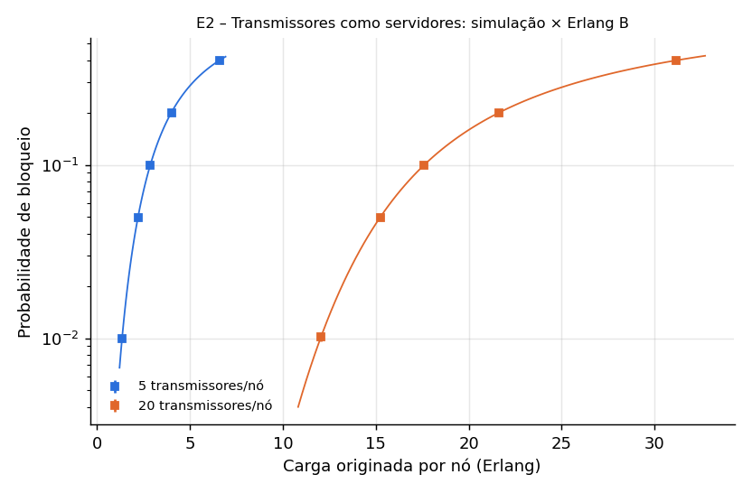

**Conclusão.** ✅ Os 10 pontos passam (maior \|z\| = 3,2, no limite de 4 EP). O bloqueio por outras causas é **exatamente 0** em todas as réplicas. Isso verifica o controle de recursos de hardware dos nós e a atribuição da causa de bloqueio.

---

## 4. E3 — Duas classes em um enlace: Kaufman–Roberts e políticas de espectro

**Cenário.** Enlace de 16 slots com duas classes de igual taxa de chegada: 25 Gbps (1 slot) e 50 Gbps (2 slots). Foram comparadas as políticas First-Fit, Last-Fit, Exact-Fit e Random-Fit.

**Oráculo.** Recursão de Kaufman–Roberts, $j\,q(j) = \sum_k A_k b_k\, q(j - b_k)$, com $B_k = \sum_{j > C - b_k} q(j)$ [3, 4]. Ela **ignora a contiguidade**, que é obrigatória em EON. Daí vêm duas expectativas:
* a classe de 2 slots e o bloqueio de banda agregado ficam **acima** de KR, porque a fragmentação só pode piorá-los;
* a classe de 1 slot pode ficar **abaixo** de KR, porque aproveita os buracos de 1 slot que a classe larga não consegue usar.

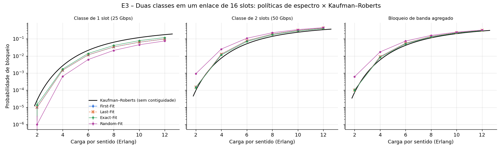

| A (Erl) | Kaufman–Roberts (1 / 2 slots / banda) | First-Fit | Exact-Fit | Random-Fit |
| :-: | :-: | :-: | :-: | :-: |
| 4 | 0,0027 / 0,0074 / 0,0058 | 0,0015 / 0,0128 / 0,0090 | 0,0017 / 0,0113 / 0,0081 | 0,0006 / 0,0252 / 0,0170 |
| 8 | 0,063 / 0,138 / 0,113 | 0,033 / 0,189 / 0,137 | 0,041 / 0,173 / 0,129 | 0,021 / 0,225 / 0,157 |
| 12 | 0,174 / 0,338 / 0,284 | 0,097 / 0,417 / 0,311 | 0,118 / 0,394 / 0,302 | 0,075 / 0,449 / 0,324 |

**Conclusão.** ✅
* Nas 24 combinações de carga e política, KR é limite inferior da classe larga e do bloqueio de banda. Como previsto, a classe de 1 slot fica abaixo de KR.
* A ordenação por bloqueio de banda é **Exact-Fit < First-Fit < Random-Fit**, a mesma relatada na literatura: Exact-Fit reduz a fragmentação e Random-Fit a maximiza.
* **First-Fit e Last-Fit deram valores idênticos em todas as réplicas e cargas.** Em um enlace único eles são imagens espelhadas do espectro e, com a mesma semente, percorrem a mesma trajetória. Essa é uma verificação forte da implementação das duas políticas.

---

## 5. E4 — Linha de 3 nós com continuidade de espectro (cadeia de Markov exata)

**Cenário.** Nós 0–1–2 com enlaces bidirecionais, 4 slots por enlace e First-Fit. Os 6 pares ordenados recebem a mesma carga $A$. Os pares 0→2 e 2→0 usam dois enlaces e exigem o **mesmo slot** nos dois.

**Oráculo.** Cadeia de Markov de tempo contínuo exata para um sentido. O estado de cada slot $i$ é $s_i \in \{$livre, ocupado por 0→1, ocupado por 1→2, ambos, ocupado por 0→2$\}$, o que dá $5^4 = 625$ estados. As transições seguem **exatamente** a regra First-Fit (menor índice viável). A solução é $\pi Q = 0$ e o bloqueio de cada fluxo é a massa dos estados em que ele não cabe (PASTA). Esse oráculo verifica ao mesmo tempo o roteamento, a continuidade, a política First-Fit e a métrica de bloqueio por par.

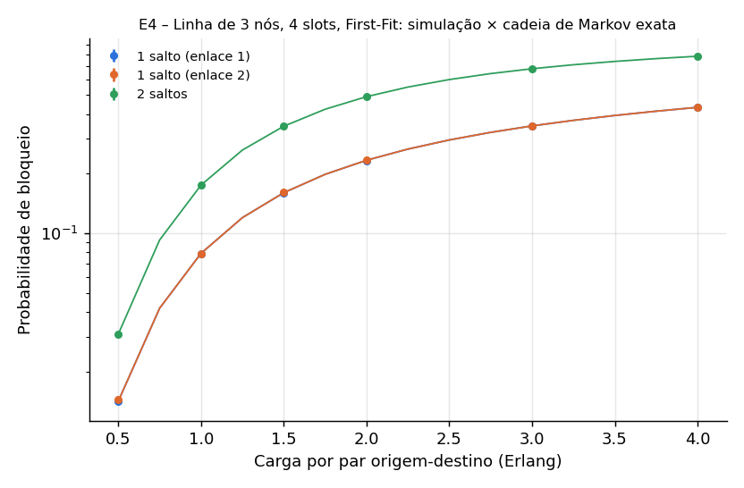

| A/par | 1 salto: exato | 1 salto: simulado | 2 saltos: exato | 2 saltos: simulado |
| :-: | :-: | :-: | :-: | :-: |
| 0,5 | 0,01417 | 0,01420 ± 0,00038 | 0,03091 | 0,03072 ± 0,00058 |
| 1,0 | 0,07916 | 0,07885 ± 0,00078 | 0,1752 | 0,1749 ± 0,0008 |
| 2,0 | 0,2339 | 0,2331 ± 0,0012 | 0,4904 | 0,4904 ± 0,0022 |
| 4,0 | 0,4330 | 0,4324 ± 0,0014 | 0,7851 | 0,7854 ± 0,0010 |

**Conclusão.** ✅ Os 18 pontos passam (maior \|z\| = 2,95), inclusive o efeito não trivial da continuidade: o par de 2 saltos bloqueia 2,2 vezes mais que o de 1 salto quando $A = 0{,}5$.

---

## 6. E5 — Algoritmos RMSA na NSFNET (sem camada física)

**Cenário.** NSFNET de 14 nós e 21 enlaces, com os comprimentos usuais da literatura de EON multiplicados por 0,5. Assim o diâmetro fica em 3900 km, abaixo dos 5000 km de alcance do 4QAM, e todos os pares são atendíveis. Demais parâmetros: 1 núcleo, 320 slots, tráfego uniforme de 100, 200 e 400 Gbps, FEC de 25 %, duas polarizações, 1 slot de guarda e QoT desligado. Foram 5 réplicas de 100 k requisições medidas.

**Oráculo.** Tendências qualitativas bem estabelecidas: First-Fit tem menos bloqueio que Random-Fit; k caminhos mais curtos têm menos bloqueio que um único caminho; e a modulação adaptativa à distância tem menos bloqueio que a modulação fixa mais robusta.

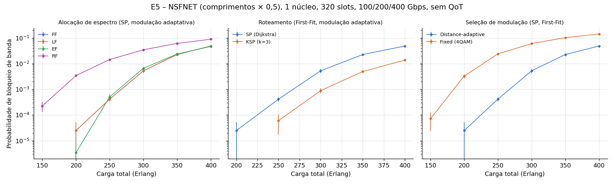

| Carga (Erl) | FF | EF | RF | KSP (k=3) | Modulação fixa (4QAM) |
| :-: | :-: | :-: | :-: | :-: | :-: |
| 250 | 0,00041 | 0,00050 | 0,0144 | 0,00006 | 0,0239 |
| 300 | 0,0052 | 0,0066 | 0,0344 | 0,00089 | 0,0601 |
| 400 | 0,0483 | 0,0468 | 0,0887 | 0,0137 | 0,1418 |

**Conclusão.** ✅ As três ordenações se confirmam em todas as cargas:
* Random-Fit bloqueia de 1,8 a 140 vezes mais que First-Fit;
* KSP reduz o bloqueio de 3,5 a 7 vezes;
* a modulação adaptativa reduz o bloqueio de 2,9 a 130 vezes.

Os bloqueios com modulação adaptativa são menores que na primeira campanha, porque os novos `maxRange` (#25) permitem formatos mais eficientes em 4QAM, 8QAM e 16QAM. First-Fit e Exact-Fit são estatisticamente equivalentes na rede. First-Fit e Last-Fit voltam a ser idênticos em todos os dígitos, porque o espelhamento vale para a rede inteira quando todos os enlaces têm o mesmo número de slots.

---

## 7. E6 — Consumo de energia

### 7.1. Potência de um circuito
**Oráculo.** $P_{circ} = 2\,(1 + n_{reg})\,(n\cdot 1{,}683\,f_{slot}\log_2 M/10^9 + 91{,}333)$ W: dois transponders, cada um com o modelo linear de Vizcaíno et al. [5]. ✅ Os 15 casos (5 modulações × 1, 4 e 16 slots) coincidem com a fórmula com erro relativo ≤ 10⁻⁹.

### 7.2. Potência média da rede e lei de Little
**Cenário.** O mesmo par de nós, com 20 slots, 40 transceptores e grau de *add/drop* 2 por nó. Foram testados três *warm-ups*: 0, 20 k e 60 k de 120 k requisições.

**Oráculo.** Pela lei de Little, o número médio de circuitos ativos é $2A(1-B)$, e portanto $\bar P = P_{est} + P_{circ}\cdot 2A(1-B)$. A potência estática é $P_{est} = \sum_{nós}(85\,n + 100\,a + 150) + 100\,N_{amp}$ W, com $a$ o grau de *add/drop* e $N_{amp}$ os amplificadores da cadeia booster + linha + pré.

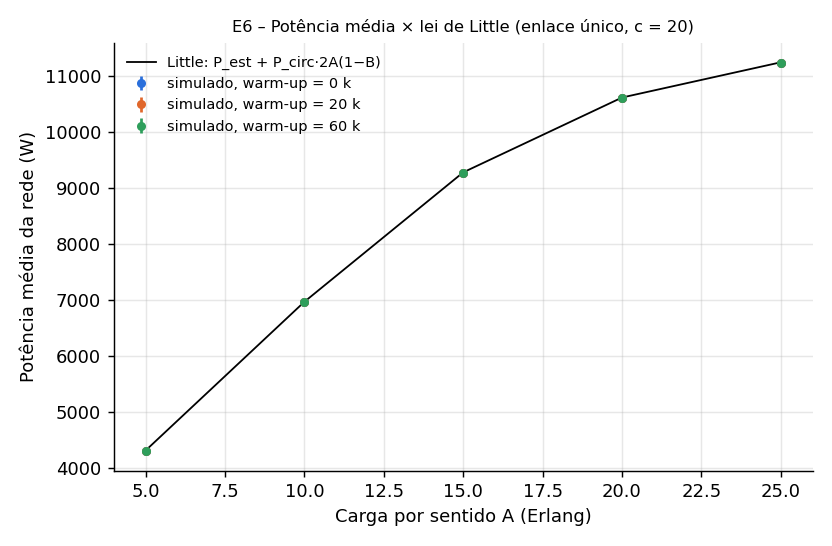

| warm-up | A (Erl) | teórico (W) | simulado (W) | erro | veredito |
| :-: | :-: | :-: | :-: | :-: | :-: |
| 0 | 10 | 6 966 | 6 958 ± 11 | −0,12 % | ✅ |
| 0 | 25 | 11 247 | 11 240 ± 5 | −0,06 % | ✅ |
| 20 k | 10 | 6 966 | 6 963 ± 9 | −0,05 % | ✅ |
| 60 k | 10 | 6 966 | 6 959 ± 17 | −0,11 % | ✅ |
| 60 k | 15 | 9 280 | 9 263 ± 16 | −0,18 % | ✅ |

**Conclusões**
* ✅ **A potência média satisfaz a lei de Little com e sem *warm-up*** nos 15 pontos. Na primeira campanha, o *warm-up* causava erros de −16,7 % e −50 % (CR-11, ver §13); a correção ([#13](https://github.com/iallengabio/SNetS2/issues/13)) integra a energia só na janela medida $[T_w, T]$ e divide por $T - T_w$. O pequeno viés negativo restante (−0,03 % a −0,18 %) está dentro do critério.
* ✅ **A potência estática não depende mais dos transceptores instalados** ([#14](https://github.com/iallengabio/SNetS2/issues/14)): o termo $a$ do OXC é o grau de *add/drop*, configurado por nó (`addDropDegree`, padrão 1).
* ✅ **Energia e ASE usam a mesma cadeia de amplificadores** ([#15](https://github.com/iallengabio/SNetS2/issues/15)): booster + $N_l$ de linha + pré-amplificador, com os mesmos ganhos.
* ⚠️ Os 100 W por amplificador e os 80 W por regenerador ocioso continuam sem referência; estão documentados como premissas do simulador. O grau $n$ do nó conta cada sentido separadamente (um par de fibras vale 2).

---

## 8. E7 — Modelos da camada física

Os parâmetros são os dos experimentos do repositório: vão de 80 km, 0,2 dB/km, NF de 5 dB, $L_{sss}$ de 5 dB, γ = 1,3·10⁻³ (W·m)⁻¹, D = 16 ps/(nm·km) e 0 dBm por canal.

### 8.1. Verificações determinísticas

| Verificação | Oráculo independente | Resultado |
| :-- | :-- | :-- |
| ASE da cadeia booster + $N_l$ de linha + pré-amplificador, de 20 a 4000 km | $\sum_k NF\,h\nu\,(G_k - 1)$ com $G_{booster} = 3L_{sss}$, $G_{linha} = \alpha L_{span}$, $G_{pré} = \alpha(L - N_l L_{span})$ | ✅ erro relativo 0 |
| SNR × potência (1 a 40 vãos, −10 a +10 dBm) | $I/(S_{ASE} + \eta I^3)$ com η do GN em forma fechada (SCI) [6] | ✅ erro ≤ 7·10⁻¹⁵ dB |
| XT × comprimento, nº de vizinhos e fração de sobreposição | $XT = n\,h\,L\,f_{sobrep.}$, $h = 2\kappa^2R/(\beta\Lambda) = 6{,}4\cdot10^{-9}$ m⁻¹ | ✅ erro ≤ 2·10⁻¹⁶ |
| Ganho fixo × carga | SNR independe da carga | ✅ constante |
| Ganho saturado × carga | SNR não cresce com a carga (§8.4) | ✅ monotônico decrescente |
| PSD variável / fixa | P constante / PSD constante | ✅ |

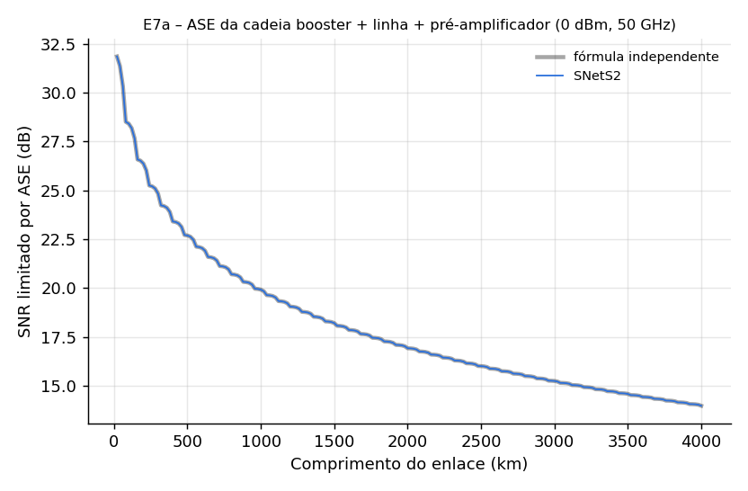

O SNR limitado por ASE cai com o comprimento em "dente de serra". Cada vez que surge um novo amplificador de linha, o pré-amplificador volta a ter ganho baixo. Isso é consequência direta do modelo de cadeia herdado do SNetS v1.

### 8.2. Potência ótima de lançamento
**Oráculo.** Com $I_{NLI} = \eta I^3$, o SNR é máximo em $I_{opt} = (S_{ASE}/2\eta)^{1/3}$, onde $SNR_{max} = I_{opt}/(1{,}5\,S_{ASE})$. As assíntotas têm inclinação +1 e −2 dB/dB.

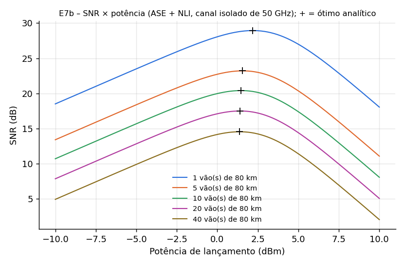

| vãos | P_ótima teórica (dBm) | P_ótima simulada (dBm) | SNR máx. teórico (dB) | SNR máx. simulado (dB) |
| :-: | :-: | :-: | :-: | :-: |
| 1 | 2,19 | 2,2 | 28,94 | 28,94 |
| 10 | 1,46 | 1,5 | 20,40 | 20,40 |
| 40 | 1,38 | 1,4 | 14,54 | 14,54 |

✅ O ótimo coincide com a previsão dentro da resolução da varredura (0,1 dB). O comportamento é o esperado pelo modelo GN [6, 7]: o ótimo está perto de 1–2 dBm para um canal de 50 GHz e é quase independente do número de vãos.

### 8.3. Alcance por QoT × `maxRange` configurado (validação)

Desde [#25](https://github.com/iallengabio/SNetS2/pull/25), o `maxRange` de cada formato é calculado pelo próprio modelo (`scripts/compute_reach.sh`): um enlace com o núcleo **completamente ocupado** por canais iguais ao testado (ASE + SCI + XCI de todos os vizinhos), a **pior** taxa de bits configurada e arredondamento para baixo em 10 km (§6.2 de `07_physical_layer_models.md`).

| Modulação | slots (100 Gbps) | limiar SNR (dB) | `maxRange` (km), carga plena | alcance, canal isolado (km) |
| :-: | :-: | :-: | :-: | :-: |
| 4QAM | 4 | 5,92 | 5 110 | ≥ 20 000 |
| 8QAM | 3 | 9,32 | 3 270 | 13 670 |
| 16QAM | 3 | 12,34 | 2 000 | 6 790 |
| 32QAM | 2 | 15,22 | 400 | 4 400 |
| 64QAM | 2 | 18,02 | 160 | 2 290 |

✅ O `maxRange` nunca excede o alcance do canal isolado, e a diferença entre as duas colunas é o efeito do XCI de um núcleo cheio. Para 32QAM e 64QAM, o pior caso é 100 Gbps: com 1–2 slots de sinal a 0 dBm, um núcleo cheio soma cerca de 22 dBm e o NLI domina. Por isso esses dois formatos ficaram **mais restritivos** que os valores antigos (625 e 312 km).

### 8.4. Ganho saturado e PSD fixa

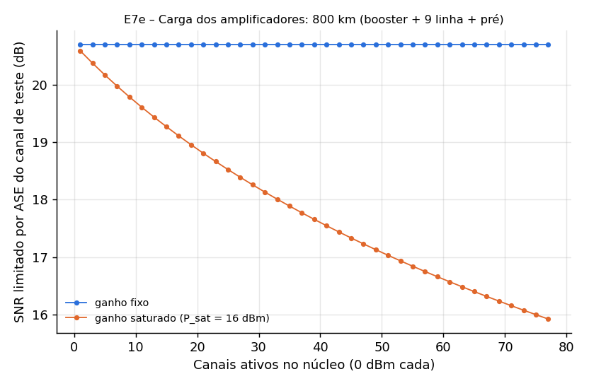

* **Ganho fixo:** o SNR de ASE de um canal de teste em 800 km é constante (20,7 dB), qualquer que seja a carga.
* **Ganho saturado** com o novo padrão $P_{sat}$ = 23 dBm ([#17](https://github.com/iallengabio/SNetS2/issues/17)): o SNR cai de 20,6 dB (1 canal) para 15,9 dB (77 canais, 18,9 dBm no total). A compressão se propaga pela cascata e o SNR **diminui** com a carga, como exige a literatura [8]. Com o padrão antigo de 16 dBm, a queda ia a 10,3 dB.
* ⚠️ A unidade de $A_2$ (W, herdada do SNetS v1) não pôde ser confirmada no artigo de Pereira et al.; a documentação registra isso.

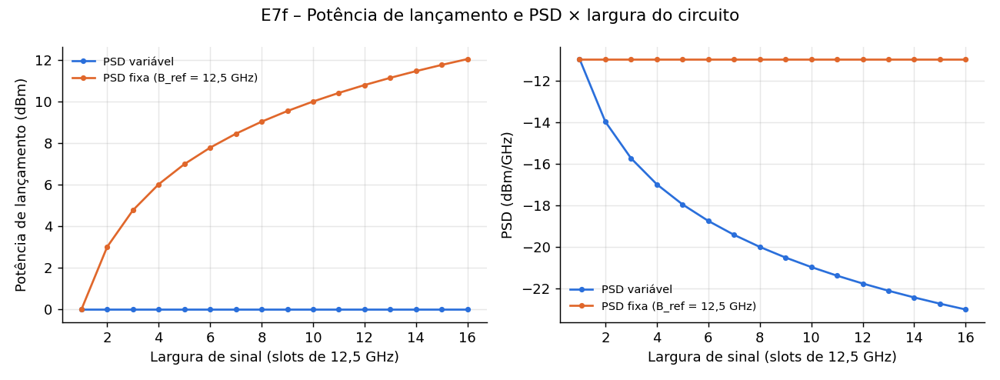

* **PSD variável:** a potência de lançamento é constante e a PSD cai com a largura do circuito.
* **PSD fixa:** a PSD fica constante em $P_{ref}/B_{ref}$ (−10,97 dBm/GHz) e a potência cresce linearmente com a largura de sinal.

### 8.5. Crosstalk

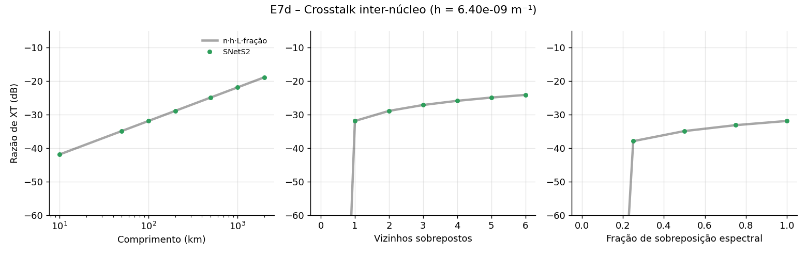

✅ A razão de XT é linear no comprimento (−31,9 dB em 100 km para um vizinho, como previsto em §5 de `07_physical_layer_models.md`), soma-se sobre os vizinhos (+7,8 dB com 6 vizinhos) e escala com a fração de sobreposição espectral.

---

## 9. E8 — Rede SDM com camada física

**Cenário.** NSFNET com comprimentos × 0,25 (75–1200 km), MCF hexagonal de 7 núcleos (núcleo 0 central com 6 vizinhos; periféricos com 3), 128 slots por núcleo, tráfego de 100/200/400 Gbps e QoT do novo circuito e dos ativos. Foram 5 réplicas de 20 k requisições medidas. Grupos:
* **efeitos físicos:** sem QoT; só ASE; ASE + NLI; ASE + NLI + XT, todos com First-Fit de núcleo e modulação `distance-adaptive`;
* **atribuição de núcleo** com todos os efeitos: First-Fit, Random-Fit, Min-crosstalk e as novas `peripheralfirstcore` e `xtawarecore` ([#18](https://github.com/iallengabio/SNetS2/issues/18)), estas também combinadas com a política de espectro `corestaggeredfit`;
* **seleção de modulação** com todos os efeitos: `distance-adaptive` × `qot-adaptive` ([#23](https://github.com/iallengabio/SNetS2/issues/23)).

**Oráculo.** Adicionar restrições físicas não pode reduzir o bloqueio. O XCI cresce com a ocupação do espectro, então o SNR médio deve cair com a carga. E, pela literatura de SDM, políticas que evitam sobreposição espectral entre núcleos adjacentes devem reduzir o bloqueio por XT.

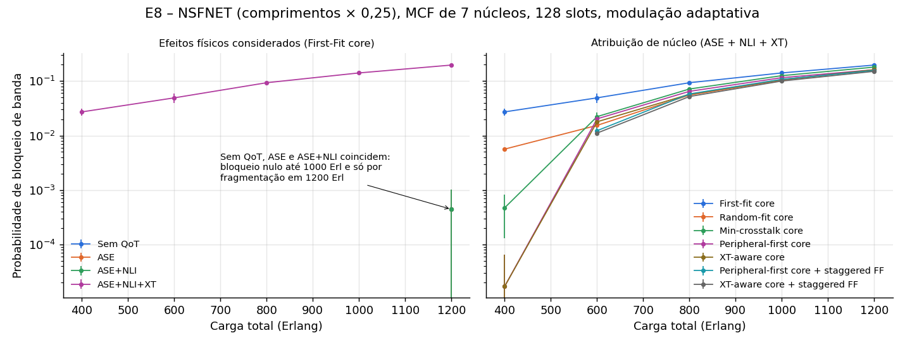

### 9.1. Efeitos físicos

| Carga (Erl) | Sem QoT | ASE | ASE + NLI | + XT | SNR médio só ASE (dB) | SNR médio ASE + NLI (dB) |
| :-: | :-: | :-: | :-: | :-: | :-: | :-: |
| 400 | 0 | 0 | 0 | 0,0272 | 21,80 | 18,74 |
| 800 | 0 | 0 | 0 | 0,0931 | 21,80 | 18,55 |
| 1200 | 0,0004 | 0,0004 | 0,0004 | 0,1963 | 21,80 | 18,45 |

* ✅ **Monotonicidade.** Sem QoT = ASE = ASE + NLI ≤ ASE + NLI + XT; as três primeiras são **idênticas** (bloqueio só por fragmentação em 1200 Erl).
* ✅ O SNR médio com ASE não depende da carga e o com NLI cai com ela, como esperado do XCI.
* ⚠️ Com a modulação por alcance, ASE e NLI não bloqueiam: o `maxRange` foi calculado com carga plena e esta rede é mais leve que essa referência. Todo o bloqueio físico vem do limiar de XT.

### 9.2. Atribuição de núcleo

| Carga (Erl) | First-Fit | Random-Fit | Min-XT | Periféricos primeiro | XT-aware | XT-aware + espectro escalonado |
| :-: | :-: | :-: | :-: | :-: | :-: | :-: |
| 400 | 0,0272 | 0,0056 | 0,0005 | 0,00002 | 0,00002 | **0** |
| 800 | 0,0931 | 0,0553 | 0,0714 | 0,0647 | 0,0571 | **0,0520** |
| 1200 | 0,1963 | 0,1606 | 0,1800 | 0,1612 | 0,1608 | **0,1506** |

* ✅ **O First-Fit de núcleo é o pior**, porque começa pelo núcleo central (6 vizinhos) e, com First-Fit de espectro, alinha os mesmos slots em núcleos adjacentes.
* ✅ **`xtawarecore` + `corestaggeredfit` fica no máximo no nível do Random-Fit em todas as cargas**, com ganho claro até 800 Erl e intervalos sobrepostos acima disso. A estratégia ordena os núcleos pela sobreposição com núcleos adjacentes nos slots que o circuito de fato ocuparia; a política de espectro faz núcleos adjacentes começarem em pontos diferentes da grade.
* ✅ As novas ordens de núcleo reduzem o bloqueio por XT nos circuitos ativos (`XT_OTHERS`) em cerca de 10 vezes em relação a First-Fit e Random-Fit.
* ⚠️ Com First-Fit de espectro, `xtawarecore` e `peripheralfirstcore` ficam levemente acima do Random-Fit entre 600 e 1000 Erl: todos os núcleos disputam os mesmos slots baixos.

### 9.3. Seleção de modulação

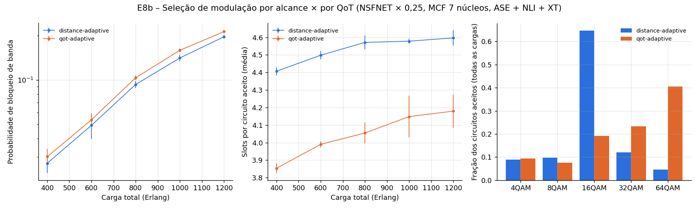

| Carga (Erl) | BP `distance-adaptive` | BP `qot-adaptive` | slots/circuito | % 64QAM |
| :-: | :-: | :-: | :-: | :-: |
| 400 | 0,0272 ± 0,0038 | 0,0301 ± 0,0039 | 4,41 → 3,85 | 4 → 46 |
| 800 | 0,0931 ± 0,0052 | 0,1033 ± 0,0037 | 4,57 → 4,05 | 5 → 40 |
| 1200 | 0,1963 ± 0,0057 | 0,2128 ± 0,0043 | 4,60 → 4,18 | 5 → 38 |

* ✅ A `qot-adaptive` escolhe formatos bem mais eficientes (até 46 % de 64QAM) e usa 9–16 % menos slots por circuito, sem deixar nenhum circuito ativo abaixo dos limiares (invariante verificado em teste).
* ✅ É a única variante em que aparece bloqueio por QoT dos circuitos estabelecidos (`QOT_OTHERS`, ~0,1–0,2 %): a política passa a operar no limite do QoT.
* ⚠️ **O bloqueio é igual até 600 Erl e 10–16 % maior a partir de 800 Erl.** Os formatos de ordem alta toleram muito menos crosstalk, e nesta rede o recurso escasso é a margem de XT, não o espectro (o bloqueio por fragmentação é zero). Uma variante com margem de SNR/XT é a continuação natural.

## 10. Limitações e ameaças à validade

* **Oráculos exatos só existem para os cenários pequenos (E1–E4).** Nos cenários de rede (E5, E8), a validação é qualitativa: ordenação e monotonicidade. A comparação quantitativa com outro simulador (L12-a) e com o GNPy (L12-d) continua pendente.
* O modelo de NLI é o GN incoerente em forma fechada, com vãos idênticos. O XCI usa o limite de alta dispersão. Não foram avaliados o modelo EGN nem efeitos de modulação.
* O XT usa o modelo de acoplamento de potência de primeira ordem ($hL \ll 1$), válido nos valores testados ($hL \le 0{,}013$).
* Os cenários de rede usam poucas réplicas (5), suficientes para as ordenações observadas, mas não para diferenças abaixo de ~10 %.
* Os oráculos estão em Python e foram escritos independentemente do código Java. Os parâmetros físicos, porém, são os mesmos dos experimentos do repositório; um erro nesses dados de entrada não seria detectado.

## 11. Situação das recomendações

| Recomendação da primeira campanha | Issue | Situação |
| :-- | :-: | :-- |
| Corrigir a média de energia com *warm-up* (CR-11) | [#13](https://github.com/iallengabio/SNetS2/issues/13) | ✅ PR #24; E6 passa em todos os *warm-ups* |
| Separar o grau de *add/drop* do número de transceptores | [#14](https://github.com/iallengabio/SNetS2/issues/14) | ✅ PR #24 (`addDropDegree`) |
| Unificar a contagem de amplificadores entre energia e ASE | [#15](https://github.com/iallengabio/SNetS2/issues/15) | ✅ PR #24 |
| Recalcular `maxRange` com o modelo físico | [#16](https://github.com/iallengabio/SNetS2/issues/16) | ✅ PR #25 (`scripts/compute_reach.sh`) |
| Revisar o padrão de P_sat | [#17](https://github.com/iallengabio/SNetS2/issues/17) | ✅ PR #25 (23 dBm); unidade de A₂ não confirmada |
| Atribuição de núcleo sensível aos slots | [#18](https://github.com/iallengabio/SNetS2/issues/18) | ✅ PR #29 (`xtawarecore`, `peripheralfirstcore`, `corestaggeredfit`) |
| Não calcular NLI/XT quando não são lidos | [#19](https://github.com/iallengabio/SNetS2/issues/19) | ✅ PR #28 (−31 % de CPU no E5, resultados idênticos) |
| Testes de regressão rápidos | [#20](https://github.com/iallengabio/SNetS2/issues/20) | ✅ PR #27 (E2–E4 e E7 no `mvn test`) |
| Validação externa (outro simulador, GNPy) | [#21](https://github.com/iallengabio/SNetS2/issues/21) | ⏳ aberta |
| Bloqueio por taxa de bits no Excel | [#22](https://github.com/iallengabio/SNetS2/issues/22) | ✅ PR #28 |
| Seleção de modulação por QoT | [#23](https://github.com/iallengabio/SNetS2/issues/23) | ✅ PR #26 (`qot-adaptive`) |

**Pendências novas**
* Seleção de modulação com margem de SNR/XT, para reduzir o bloqueio da `qot-adaptive` em redes limitadas por crosstalk (§9.3).
* Referências para os 100 W por amplificador e 80 W por regenerador, e decisão sobre a contagem do grau $n$ do nó (§7.2).
* Confirmação da unidade de $A_2$ no artigo de Pereira et al. (§8.4).

## 12. Reprodução

```bash
pip install -r scripts/verification/requirements.txt
scripts/verification/run_campaign.sh              # todos os experimentos
scripts/verification/run_campaign.sh erlang tandem # apenas alguns
```

Versões rápidas (≈ 10 s) dos experimentos com oráculo exato rodam no `mvn test`: `ErlangBSingleLinkTest` (E1), `LossNetworkOraclesTest` (E2–E4), `EnergyModelTest` (E6b) e `PhysicalLayerOraclesTest` / `PhysicalLayerMagnitudeTest` (E7).

O script compila o simulador, roda `VerificationCampaign` (CSV em `docs/review/vv/data`) e `analyze.py` (figuras em `docs/review/vv/figures` e tabelas em `docs/review/vv/tables.md`). Com as mesmas sementes, os resultados são reprodutíveis bit a bit.

## 13. Histórico: primeira campanha (após o PR #11)

A primeira execução desta campanha, antes das correções, obteve os mesmos resultados de E1–E4 e da verificação determinística de E7. As diferenças foram:
* **E6:** com *warm-up*, a potência média saía −16,7 % (20 k) e −50,0 % (60 k) abaixo da lei de Little, exatamente o fator $(1 - T_w/T)$; e, com 10⁶ transceptores por nó, a potência estática chegava a 4·10⁸ W.
* **E7c/E8:** o `maxRange` de tabela (5000/2500/1250/625/312 km) era 4–7 vezes menor que o alcance do canal isolado, e ASE e NLI nunca bloqueavam.
* **E7e:** com P_sat = 16 dBm, o SNR de ASE caía de 20,2 para 10,3 dB com 77 canais.
* **E8:** o Min-crosstalk só era melhor que o First-Fit de núcleo em carga baixa, e nenhuma estratégia batia o Random-Fit.

Os dados e figuras dessa execução estão no histórico do git (commit `d7b61a3`).

## Referências

1. A. K. Erlang, "Solution of some problems in the theory of probabilities of significance in automatic telephone exchanges", *Elektroteknikeren*, 1917.
2. J. D. C. Little, "A proof for the queuing formula L = λW", *Operations Research*, vol. 9, no. 3, 1961.
3. J. S. Kaufman, "Blocking in a shared resource environment", *IEEE Trans. Commun.*, vol. 29, no. 10, 1981.
4. J. W. Roberts, "A service system with heterogeneous user requirements", in *Performance of Data Communication Systems and their Applications*, North-Holland, 1981.
5. J. L. Vizcaíno, Y. Ye, I. Tafur Monroy, "Energy efficiency analysis for flexible-grid OFDM-based optical networks", *Computer Networks*, vol. 56, no. 10, 2012.
6. P. Poggiolini, "The GN Model of Non-Linear Propagation in Uncompensated Coherent Optical Systems", *J. Lightwave Technol.*, vol. 30, no. 24, 2012.
7. P. Johannisson, E. Agrell, "Modeling of Nonlinear Signal Distortion in Fiber-Optic Networks", *J. Lightwave Technol.*, vol. 32, no. 23, 2014.
8. H. A. Pereira, D. A. R. Chaves, C. J. A. Bastos-Filho, J. F. Martins-Filho, "OSNR model to consider physical layer impairments in transparent optical networks", *Photonic Network Communications*, vol. 18, 2009.
